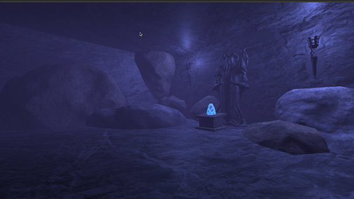
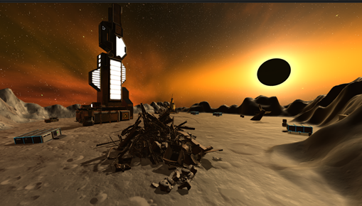
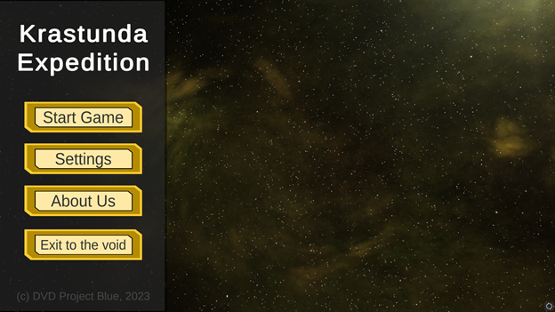
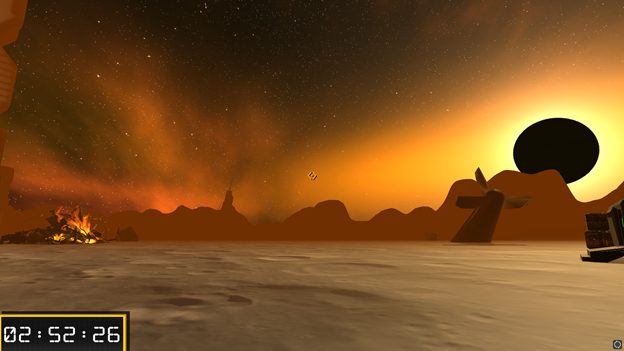
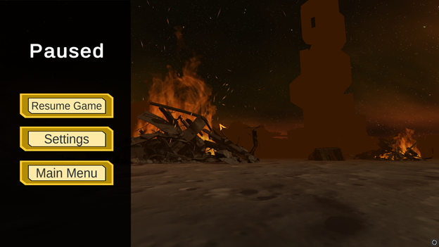

# Krastunda Expedition

> [!WARNING]
> This project has been archived due to these reasons:
> - Game is finished and isn't planning to be updated.

> [!NOTE]
> This repository contains C# scripts for Unity game that was created for Unity Game Development course at the university.
> 
> Goal of the game is to evacuate from the planet during 3 minutes.
>
> Features:
> - Player is capable of interacting, using and inspecting certain items.
> - Player is controllable via keyboard and mouse.
> - Player doesn't have any HP (hit points) and can only "die", if timer runs out.
> - Working Pause Menu, Settings and User Preferences.
> - Game is aimed purely on lore and atmospherics.
>
> Game Development Team:
> - Aleksejs Kareļins (@Wolferado) - Programmer
> - Ņikita Dolženkovs (@tinuzu) - Script
> - Aleksejs Tihomirovs (@werdillo) - Music
> - Germans Vinogradovs (@geraknjaz) - UI/UX
> - Aleksandrs Jelmanovs - SFX 
> - Andrejs Gavriļuks - Testing

> [!TIP]
> In releases it is possible to download the game and try it out for yourself.

> [!IMPORTANT]
> **All models and assets belong to the respective owners.**

Game showcase is available [here](https://youtu.be/8T3rPCWFpBM).

### Levels:

### UI and Gameplay

### Assets and Models used:

1.	"The Chest of Broken Heart" (https://skfb.ly/opCIx) by yuraxv is licensed under Creative Commons Attribution (http://creativecommons.org/licenses/by/4.0/).
2.	"Broken Tail" (https://skfb.ly/oqHuY) by Thunder is licensed under Creative Commons Attribution (http://creativecommons.org/licenses/by/4.0/).
3.	"Clipboard" (https://skfb.ly/6GxN6) by Cookie is licensed under Creative Commons Attribution (http://creativecommons.org/licenses/by/4.0/).
4.	"Sci-fi Crate Textured By Finn Swift" () by Finn_Swift is licensed under Creative Commons Attribution (http://creativecommons.org/licenses/by/4.0/).
5.	"Sci-fi Genenric Building" (https://skfb.ly/oKTJG) by Ruslan Abbasov is licensed under Creative Commons Attribution (http://creativecommons.org/licenses/by/4.0/).
6.	"Sci-Fi Tower" (https://skfb.ly/LWAD) by Jonathan is licensed under Creative Commons Attribution (http://creativecommons.org/licenses/by/4.0/).
7.	"Sci Fi Base Camp Shelter" (https://skfb.ly/oNLsT) by Cosimo is licensed under Creative Commons Attribution (http://creativecommons.org/licenses/by/4.0/).
8.	"Spaceship" (https://skfb.ly/6GnGY) by Shedmon is licensed under Creative Commons Attribution (http://creativecommons.org/licenses/by/4.0/).
9.	"Key with Tag" (https://skfb.ly/oAqSG) by AxonDesigns is licensed under Creative Commons Attribution (http://creativecommons.org/licenses/by/4.0/).
10.	"Arch" (https://skfb.ly/6xLsN) by Sylzebub is licensed under Creative Commons Attribution (http://creativecommons.org/licenses/by/4.0/).
11.	"Low poly Crystal (game ready asset)" (https://skfb.ly/oMQNt) by Pixel Life is licensed under Creative Commons Attribution (http://creativecommons.org/licenses/by/4.0/).
12.	"Wall Torch" (https://skfb.ly/onW7Z) by Sean Thomas is licensed under Creative Commons Attribution (http://creativecommons.org/licenses/by/4.0/).
13.	"Doom Eternal - Estatua De Culto Maykr" (https://skfb.ly/6ZrQq) by Dante_Abraham is licensed under Creative Commons Attribution (http://creativecommons.org/licenses/by/4.0/).

[^1]: [Source of the Markdown](https://docs.github.com/en/get-started/writing-on-github/getting-started-with-writing-and-formatting-on-github/basic-writing-and-formatting-syntax)
[^2]: My reference.
[^3]: To add line breaks within a footnote, prefix new lines with 2 spaces.
  This is a second line.
